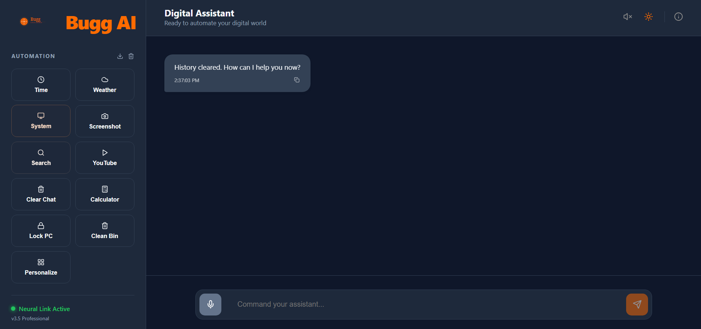

# 🤖 Bugg AI – Advanced Digital Assistant (v3.5 Pro)



**Bugg AI** is a professional-grade, full-stack digital assistant featuring a high-performance React frontend and a robust Python backend. It utilizes a **Hybrid Multi-Layer Intelligence Architecture** designed for speed, privacy, and advanced reasoning.

---

## 🏗️ Architectural Depth

Bugg AI is built on a modular, four-layer architecture that ensures reliability and extensibility.

### 1. Presentation Layer (Frontend)
*   **Technology**: React 18, Vite, TypeScript, Tailwind CSS.
*   **Role**: Provides a sleek, modern dashboard for user interaction.
*   **Features**:
    *   Real-time chat interface with state management.
    *   Integrated Web Speech API for browser-level voice recognition.
    *   Dynamic system health monitoring (CPU, RAM, Battery).
    *   Personalization hub for user-specific links and profiles.

### 2. Communication Layer (API)
*   **Technology**: FastAPI (Python).
*   **Role**: High-performance asynchronous bridge between the UI and the Intelligence Engine.
*   **Endpoints**: Standardized RESTful endpoints (e.g., `/ask`) to handle text-based queries and command execution.

### 3. Intelligence Layer (The "Brain")
Bugg AI uses a **Triple-Tier Fallback System** to ensure it can answer any query:
1.  **Local Intent Engine**: A custom-trained Neural Network (Keras/TensorFlow) trained on `intents.json`. It provides sub-500ms response times for system-specific commands.
2.  **Offline LLM (Ollama/Llama3)**: If the local engine doesn't recognize the intent, the system calls a locally hosted Llama3 model via Ollama. This ensures 100% privacy for sensitive queries without needing an internet connection.
3.  **Cloud Intelligence (Google Gemini 1.5 Flash)**: The final fallback for complex, real-time online reasoning and creative tasks.

### 4. Execution & Hardware Layer
*   **System Automation**: Uses `PyAutoGUI` and `subprocess` for screenshots, application launching, and folder navigation.
*   **Media Control**: `pycaw` for fine-grained audio management (mute/volume) and `pywhatkit` for YouTube automation.
*   **Hardware Monitoring**: `psutil` for real-time telemetry.
*   **Voice Core**: Offline `pyttsx3` for text-to-speech and `SpeechRecognition` for standalone voice-only mode (`bot.py`).

---

## 🔄 How It Works (The Lifecycle of a Query)

1.  **Input Acquisition**: The user types a query in the React dashboard or speaks a command.
2.  **Ingestion**: The frontend sends the query to the FastAPI `/ask` endpoint.
3.  **Classification**: The `AssistantEngine` tokenizes and lemmatizes the input, then passes it through the **Local Intent Model**.
4.  **Decision Path**:
    *   **Known Intent**: If the confidence is high (>0.5), the engine triggers a **Task**. For example, "Take a screenshot" triggers the `pyautogui` logic.
    *   **Unknown Intent**: The engine automatically waterfalls to **Ollama** (Local AI) then **Gemini** (Cloud AI).
5.  **Action & Feedback**: The task is executed on the host machine, and a natural language response is generated and returned to the UI.

---

## 📁 Project Structure

```text
AI-Virtual-Assistent-main/
├── backend/                # Python FastAPI & AI Core
│   ├── api.py              # REST API Gateway
│   ├── assistant_engine.py # Strategic orchestration & AI Fallback logic
│   ├── train.py            # Neural Net training script (NLTK + Keras)
│   ├── intents.json        # Dataset for local classification
│   ├── chatbot.h5          # Compiled binary of the trained brain
│   ├── bot.py              # Standalone voice-first assistant loop
│   ├── tasks.py            # OS-level automation logic
│   └── listen/say.py       # STT and TTS drivers
├── frontend/               # React + Vite Dashboard
│   ├── src/                # Component logic (App.tsx, Sidebar, etc.)
│   └── public/             # Visual assets and icons
├── scripts/                # One-click deployment scripts (.bat / .sh)
└── .env                    # Configuration for Gemini & Weather APIs
```

---

## ⚙️ Quick Start

### 1. Setup Backend
```bash
cd backend
pip install -r requirements.txt
python train.py      # Train the local intent model
python api.py        # Start the FastAPI server (Port 8001)
```

### 2. Setup Frontend
```bash
cd frontend
npm install
npm run dev          # Start the dashboard (Port 5173)
```

### 3. Enable Privacy Layer (Optional)
To enable offline AI, install [Ollama](https://ollama.com) and run:
```bash
ollama run llama3
```

---

## 🧪 Technical Stack

| Category | Technology |
| :--- | :--- |
| **Frontend** | React, TypeScript, Vite, Tailwind CSS |
| **Backend** | FastAPI, Python 3.10+ |
| **Neural Net** | TensorFlow, Keras, NLTK |
| **LLMs** | Google Gemini (Cloud), Ollama/Llama3 (Local) |
| **Automation** | PyAutoGUI, Psutil, Pycaw, Wikipedia |

---

## 🙋‍♂️ Author

Developed by **Prince Joshi**  
*“Building intelligent bridges between humans and machines.”*

---

## 📄 License

Available under the [MIT License](LICENSE).
